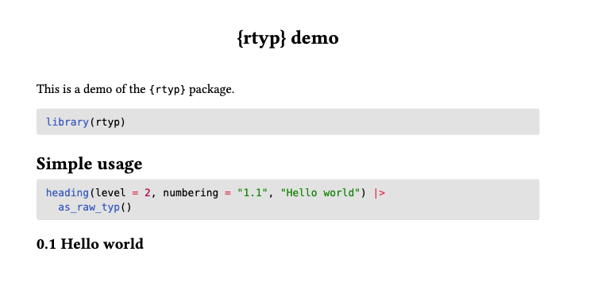

# Using r2typ in Quarto documents

[r2typ](https://y-sunflower.github.io/r2typ/) will output valid format
for your Quarto documents assuming you have the
[knitr](https://yihui.org/knitr/) package installed, which is probably
the case.

## Basic usage

```` markdown
---
title: "{r2typ} demo"
format: typst
---

This is a demo of the `{r2typ}` package.

```{r}
library(r2typ)
```

## Simple usage

```{r}
heading(level = 2, numbering = "1.1", "Hello world")
```

## Using show rule

```{r}
show_heading(set_text(fill = red))
heading(level = 2, numbering = "1.1", "Hello world")
```
````



## Advanced usage

[r2typ](https://y-sunflower.github.io/r2typ/) becomes very interesting
when using dynamic values and advanced function calls. For example, here
we use a parameter and add it inside the text of a circle:

```` markdown
---
title: "{r2typ} demo"
format: typst
params:
  country: Germany
---

This is a demo of the `{r2typ}` package.

```{r}
library(r2typ)
library(glue)
```

## Complex usage

```{r}
align(
  center + horizon,
  circle(
    width = percent(40),
    fill = aqua,
    stroke = pt(5) + rgb("#ffc300"),
    align(
      right,
      text(
        font = "Roboto",
        size = em(1.2),
        fill = purple,
        glue("My favorite country is {params$country}")
      )
    )
  )
)
```
````


