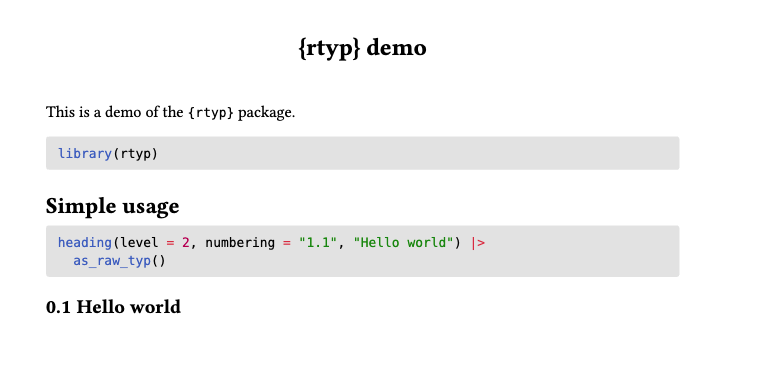

```{r, include = FALSE}
knitr::opts_chunk$set(
  collapse = TRUE,
  comment = "#>",
  message = FALSE
)
```

```{r setup}
#| message: false
library(rtyp)
```

To include the output of `{rtyp}` in your Quarto documents, you need to convert it to "raw" Typst with the `as_raw_typ()` function.

````md
---
title: "{rtyp} demo"
format: typst
---

This is a demo of the `{rtyp}` package.

```{{r}}
library(rtyp)
```

## Simple usage

```{{r}}
heading(level = 2, numbering = "1.1", "Hello world") |>
  as_raw_typ()
```
````



Calling `as_raw_typ()` will convert your Typst markup to a valid format to be interpreted by Quarto and the Typst compiler.